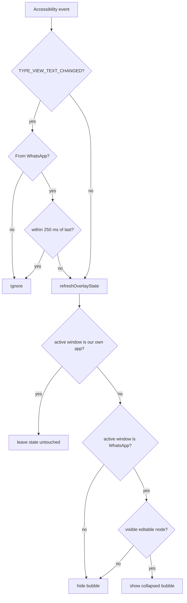
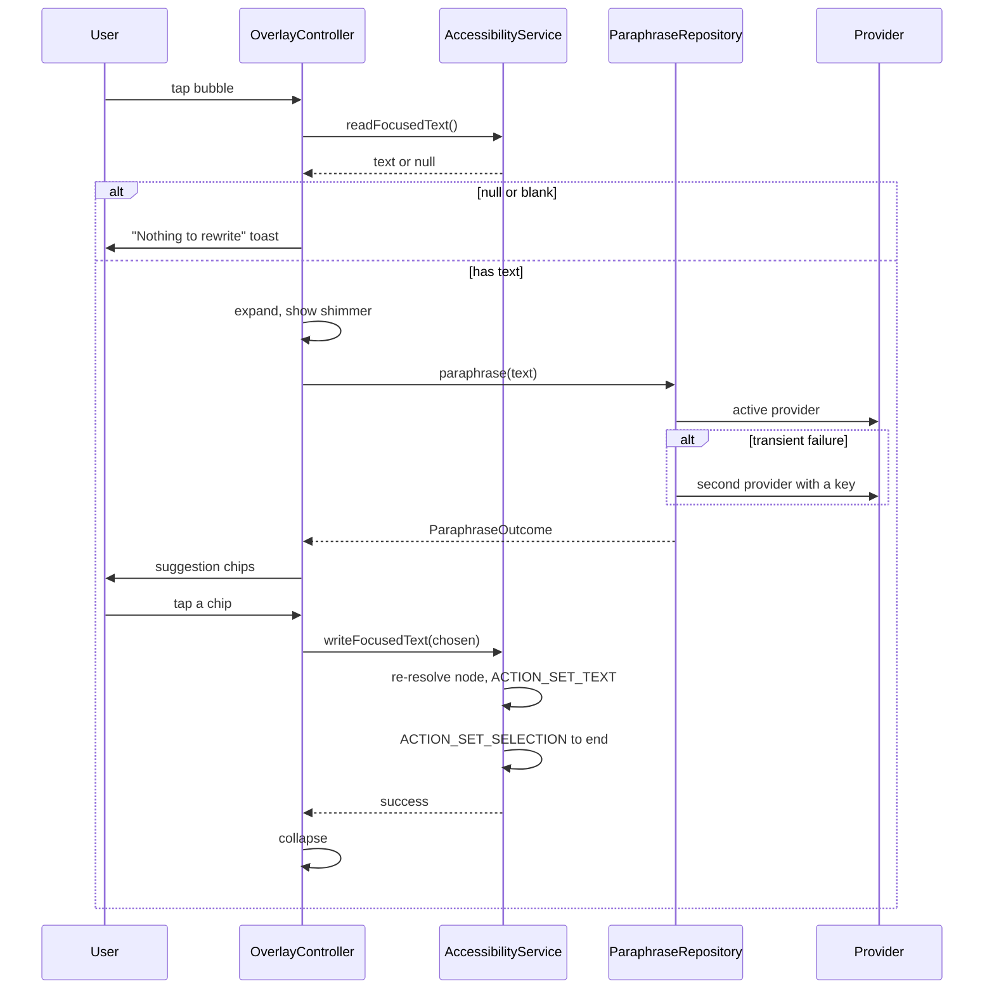

# Architecture

How Silvertongue is put together, what each layer owns, and why the non-obvious choices were made.
Read this before changing structure. For implementation detail inside a layer, see
[TECHNICAL.md](TECHNICAL.md).

---

## Shape

One Gradle module (`:app`), package `com.silvertongue.paraphraser`, Kotlin + Jetpack Compose.
Roughly 2,100 lines of Kotlin. There is deliberately no multi-module split: the app is small, has one
consumer, and module boundaries would cost more than they buy.

```
com.silvertongue.paraphraser
├── AppGraph.kt                     manual dependency container
├── ParaphraserApplication.kt       installs AppGraph
├── MainActivity.kt                 setup screen host
├── service/                        accessibility layer
│   ├── ParaphraserAccessibilityService.kt
│   └── TextFieldWriter.kt
├── overlay/                        floating window layer
│   ├── OverlayController.kt
│   ├── OverlayLifecycleOwner.kt
│   ├── OverlayContent.kt
│   ├── OverlayUiState.kt
│   └── FocusedTextBridge.kt
├── paraphrase/                     LLM layer
│   ├── ParaphraseProvider.kt       interface + failure taxonomy
│   ├── ParaphraseRepository.kt     provider selection + fallback
│   ├── ProviderPreferences.kt      test seam
│   ├── GroqProvider / GeminiProvider / AnthropicProvider
│   ├── Prompts.kt, SuggestionParser.kt
│   └── HttpClients.kt, NetworkCall.kt
├── ui/                             setup screen
└── data/SettingsRepository.kt      DataStore persistence
```

---

## Layer ownership

Stated as owns / does not own, so the boundary is unambiguous.

### `service/` — ParaphraserAccessibilityService

**Owns:** the accessibility event stream; deciding whether a WhatsApp editable field is focused;
resolving the live node; reading text from it; writing text back into it; the lifecycle of the
overlay controller.

**Does NOT own:** anything about how the overlay looks, LLM calls, or persistence. It never touches
Compose.

It implements `FocusedTextBridge` (`readFocusedText`, `writeFocusedText`) — the only surface the
overlay is allowed to use to reach WhatsApp.

### `overlay/` — OverlayController

**Owns:** the single `WindowManager` window and its `LayoutParams`; the collapsed/expanded state
machine; drag and position persistence; the Compose tree inside the window; calling the repository
and mapping the result to UI state.

**Does NOT own:** any knowledge of accessibility nodes. It asks `FocusedTextBridge` for text and
hands text back. It never sees an `AccessibilityNodeInfo`.

### `paraphrase/` — ParaphraseRepository and providers

**Owns:** provider selection, fallback policy, the failure taxonomy, prompt text, defensive parsing
of model output, HTTP.

**Does NOT own:** anything Android-UI. The only Android dependency is `android.util.Log`.
`ParaphraseProvider` implementations know one API each and nothing about each other.

### `ui/` — MainActivity, MainScreen, MainViewModel

**Owns:** the setup screen, permission status presentation, the in-app test field, provider choice
and key entry, the self-repair action.

**Does NOT own:** the overlay or the service. It reads permission state; it never drives the bubble.

### `data/` — SettingsRepository

**Owns:** DataStore persistence for active provider, per-provider key overrides, and bubble position;
resolution order for keys (in-app override wins over `BuildConfig`).

**Does NOT own:** any policy about *when* a key is used.

---

## Data flow

### Showing and hiding the bubble



The `our own app` branch exists because `ACTION_SET_TEXT` fires a text-changed event while the
overlay window is tearing down; without it the bubble vanished after every insertion.

### Rewrite and insert



Note the node is resolved **twice** — once to read, once to write. Nothing is cached between.

---

## Decisions and why

Each of these deviates from the obvious approach or from the original spec. The rationale matters
more than the rule.

### The overlay window is never focusable

`FLAG_NOT_FOCUSABLE` is set in both states. The panel only needs taps, and a non-focusable window
still receives touches inside its own bounds. Taking focus would move input focus off WhatsApp's
`EditText`, which breaks `ACTION_SET_TEXT`.

*Cost:* the Back gesture does not dismiss the panel. Dismissal is the ✕ or a tap outside, via
`FLAG_WATCH_OUTSIDE_TOUCH`.

### No `android:packageNames` filter in the service config

The spec called for `android:packageNames="com.whatsapp"`. That filter is wrong here: with it, the
service receives no event when the user *leaves* WhatsApp, so the bubble stays parked over whatever
app comes next. The filter lives in code instead (`TARGET_PACKAGES`, which also covers
`com.whatsapp.w4b`).

*Cost:* window content from every app reaches the service. Mitigated by an early package check on the
noisiest event type, and by gating all text logging behind both `BuildConfig.DEBUG` **and** a WhatsApp
package check.

### No `AccessibilityNodeInfo` is cached

The spec suggested caching the node before expanding. Nodes go stale quickly, and the panel stays
open across a network round trip. Only the *text* is captured at expand time; the node is re-resolved
via `findFocus(FOCUS_INPUT)` immediately before writing, with a breadth-first scan as fallback.

### Insertion has a clipboard fallback, but only on genuine failure

`ACTION_SET_TEXT` first, then `ACTION_SET_SELECTION` to move the caret to the end. Only if the action
is absent from the node's action list or `performAction` returns false does it fall back to clipboard
plus `ACTION_PASTE`. It is deliberately not the default path because Android 13+ shows a clipboard
toast on every write.

### Permission state comes from liveness, not settings strings

A crashed or killed accessibility service stays listed in `ENABLED_ACCESSIBILITY_SERVICES`, so the
setup screen once reported "Granted" for a service that was not running. The row now requires
`ParaphraseAccessibilityService.isRunning`, set on connect and cleared on unbind.

The overlay row has no equivalent fix available: MIUI's own pop-up switches are not readable by any
public API, so on affected ROMs the row carries an explicit caveat instead of a false claim.

### Fallback only on transient failures

`ParaphraseRepository` retries on a second provider for `TRANSPORT`, `RATE_LIMITED`, `SERVER_ERROR`
and `MODEL_UNAVAILABLE` only. `NO_KEY`, `BAD_RESPONSE` and `REFUSED` surface immediately — retrying
those doubles latency for the same outcome. The happy path issues exactly one request, unchanged.

The answering provider is surfaced in the UI so a silent fallback never hides a broken primary.

### `ProviderPreferences` exists purely as a test seam

`ParaphraseRepository` originally depended on `SettingsRepository`, which is welded to Android
DataStore and cannot run in a JVM test. A two-method interface broke that dependency so fallback
policy could be tested with fakes rather than asserted.

### `WRITE_SECURE_SETTINGS` for self-repair

Android forbids an app from enabling its own accessibility service. For a sideloaded app the
permission can be granted once over adb, after which the setup screen can re-bind the service in one
tap. The grant survives data clears and `install -r`; it is lost only on uninstall. Without it the
UI shows the grant command instead of the button.

### Plain OkHttp rather than Retrofit

Three providers with three unrelated request and response shapes. Retrofit would need three
interfaces and buy nothing. One shared `OkHttpClient` plus kotlinx.serialization is leaner.

---

## Dependency wiring

`AppGraph` is a hand-rolled singleton container installed from `ParaphraserApplication.onCreate`. It
exposes `settings` and `paraphraseRepository`. There is no DI framework — two dependencies do not
justify one.

Both `MainActivity` (via `MainViewModel`) and `OverlayController` reach the repository through
`AppGraph`. The accessibility service and the activity share a process, which is what makes the
`isRunning` liveness flag valid.

---

## Threading

- Accessibility callbacks arrive on the main thread; all work there is cheap and synchronous.
- `OverlayController` holds a `CoroutineScope(SupervisorJob() + Dispatchers.Main.immediate)` owned by
  the service, cancelled on unbind.
- Network calls suspend via `OkHttp.enqueue` wrapped in `suspendCancellableCoroutine`, so cancelling
  the job cancels the call.
- Only one request is in flight at a time; repeat taps are ignored while `requestJob` is active.
